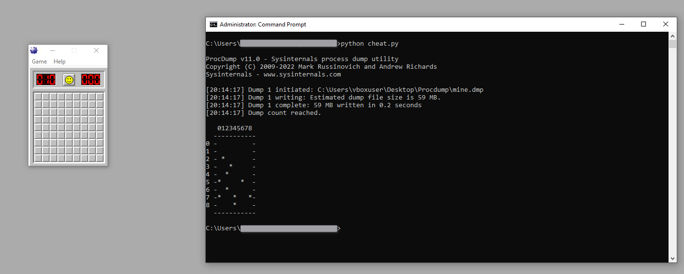
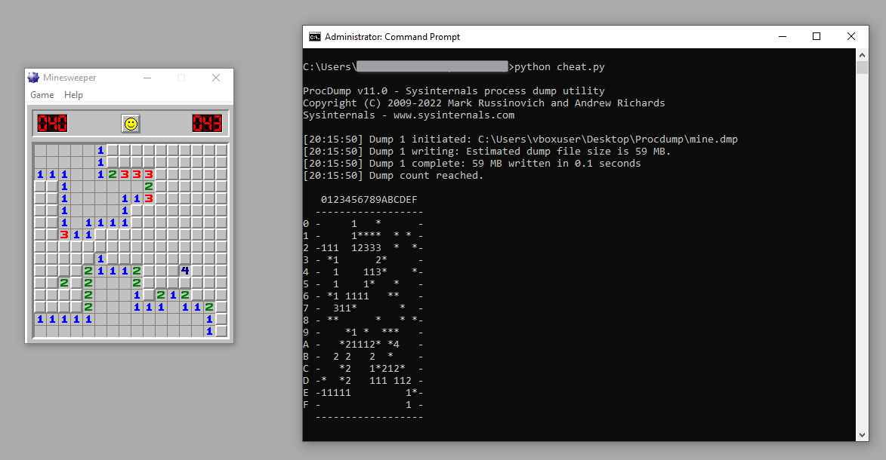
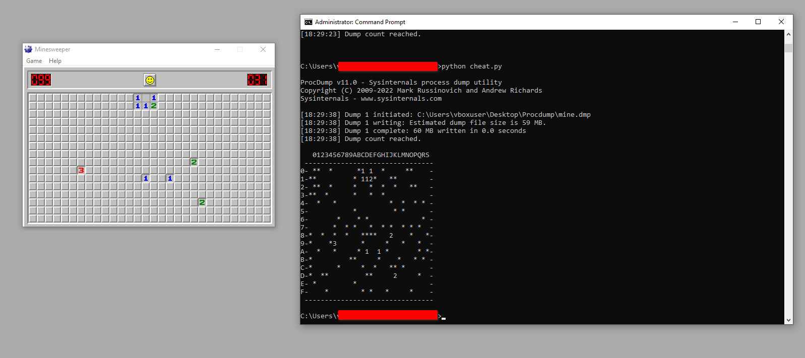

## Minesweeper
I saw this tutorial written by Sam Bowne for beginners. This tutorial is written in Python 2, so I rewrote it in Python 3 and added intermediate and expert levels. The custom board is still a to-do.

The tutorial uses ProcDump for memory dumping. First, we run the Minesweeper executable in a debugger. While it’s still in debug mode, we dump the memory and search for the game board in the memory dump. When we find the board, we display it in the console.

 

### Beginner Level

  

### Intermediate Level

  

### Expert Level

  

